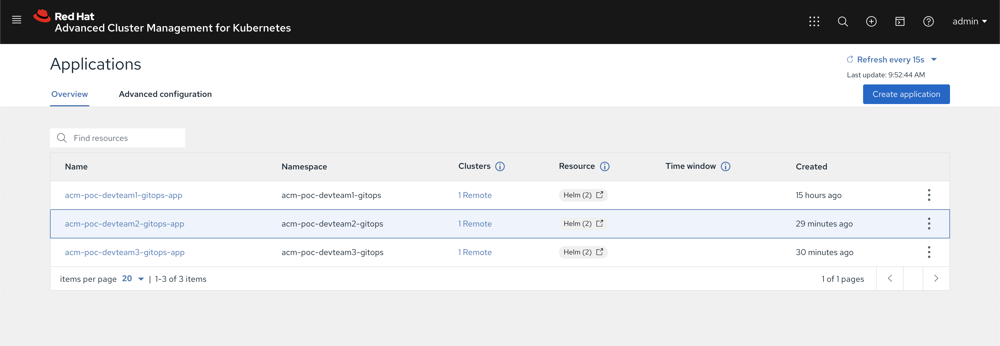

# ACM SRE GitRepo


## Policies
---
**Policy management** is a requirement when multiple clusters. When we apply policies to a cluster we gain consistent governance as a result. Governance and risk are used to define the process that are used to managed the secuirty and compliance of the target cluster. We will be practicing managing governance and risk towards are target clusters. Example policys can be found in the [Policy Collection](https://github.com/open-cluster-management/policy-collection) repo. 


## Tenants
---
**Multi-tenant** cluster is shared by multiple users an or workloads. This is referred to as **"tenants"**. An the operator of mutli-teant clusters we can isolate tenants from each other. In this repo we are practicing the isolation of three dev teams on three different environment. 
The isolation of the environment is managed by namespaces or projects. The Policies of the target clusters are managed by ACM. The Application is managed by ACM and the applications are packaged as Helm Charts. 

After creating the required application definitions for each dev team. Please have dev team fork the [acm-multi-tenancy-dev-team](https://github.com/quarkuscoffeeshop/acm-multi-tenancy-dev-team). Repo in order to push applicatio to ACM and target clusters. 

### Commands for dev-team-1
---
**The command below defines the target namespace ACM will use to manage the applciation.**
```
oc create -f   acm-configs/tenants/dev-team-1/01_namespace.yaml 
```

**The command below defines the location of the helm repo the application will use.**
```
oc create -f   acm-configs/tenants/dev-team-1/02_channel.yaml 
```

**The command below will subscribe to to the above channel**
```
oc create -f   acm-configs/tenants/dev-team-1/03_application_webapp.yaml 
```

**The command below will define a placement rule for any cluster with the tag environment=dev**
```
oc create -f   acm-configs/tenants/dev-team-1/dev_placement_rule.yaml
```

**The command below will define a placement rule for any cluster with the tag environment=staging**
```
oc create -f   acm-configs/tenants/dev-team-1/staging_placement_rule.yaml
```

**The command below will define a placement rule for any cluster with the tag environment=prod**
```
oc create -f   acm-configs/tenants/dev-team-1/prod_application_webapp.yaml 
```


### Commands for dev-team-2
---
**Create namespace for dev-team-2**
```
oc create -f   acm-configs/tenants/dev-team-2/01_namespace.yaml 
```

**Create channel for dev-team-2**
```
oc create -f   acm-configs/tenants/dev-team-2/02_channel.yaml 
```

**Create application definition for dev-team-2**
```
oc create -f   acm-configs/tenants/dev-team-2/03_application_webapp.yaml 
```

**Create placement rule for dev clusters for dev-team-2**
```
oc create -f   acm-configs/tenants/dev-team-2/dev_placement_rule.yaml
```

**Create placement rule for staging clusters for dev-team-2**
```
oc create -f   acm-configs/tenants/dev-team-2/staging_placement_rule.yaml
```

**Create placement rule for production clusters for dev-team-2**
```
oc create -f   acm-configs/tenants/dev-team-2/prod_application_webapp.yaml 
```

### Commands for dev-team-3
---
**Create namespace for dev-team-3**
```
oc create -f   acm-configs/tenants/dev-team-3/01_namespace.yaml 
```

**Create channel for dev-team-3**
```
oc create -f   acm-configs/tenants/dev-team-3/02_channel.yaml 
```

**Create application definition for dev-team-3**
```
oc create -f   acm-configs/tenants/dev-team-3/03_application_webapp.yaml 
```

**Create placement rule for dev clusters for dev-team-3**
```
oc create -f   acm-configs/tenants/dev-team-3/dev_placement_rule.yaml
```

**Create placement rule for staging clusters for dev-team-3**
```
oc create -f   acm-configs/tenants/dev-team-3/staging_placement_rule.yaml
```

**Create placement rule for production clusters for dev-team-3**
```
oc create -f   acm-configs/tenants/dev-team-3/prod_application_webapp.yaml 